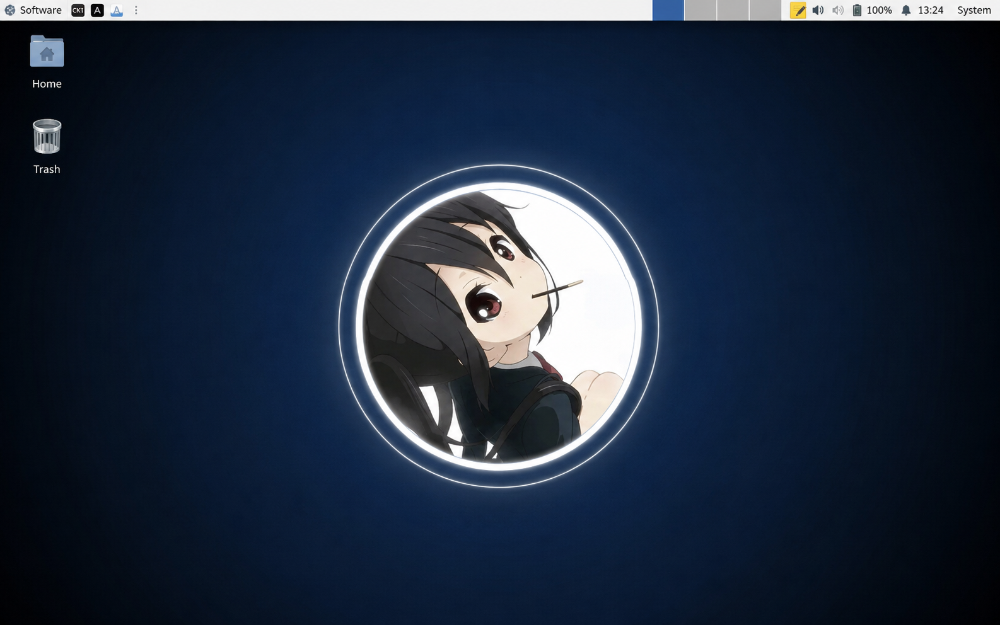
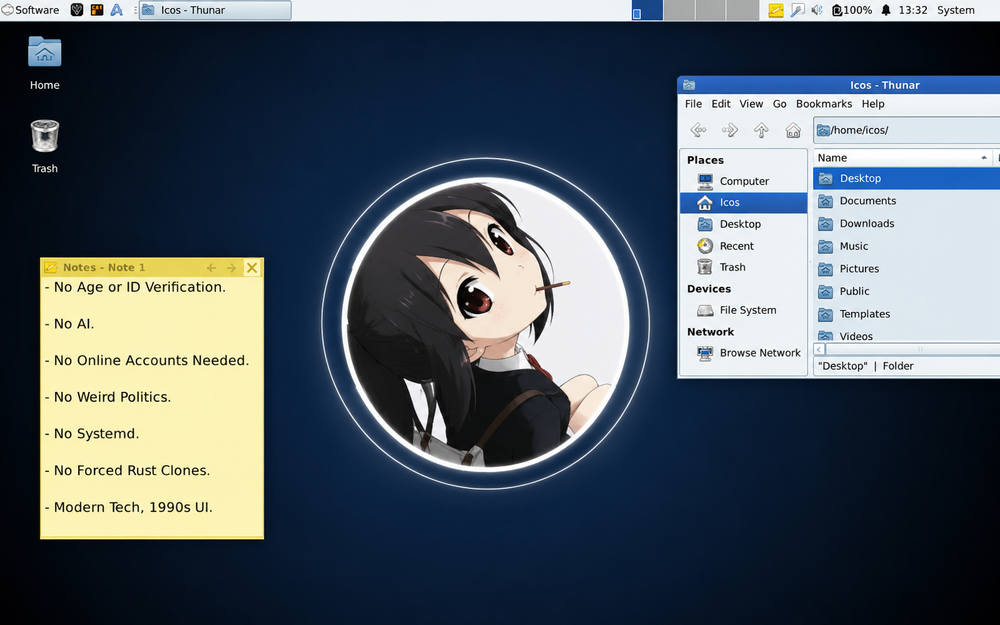

# The Nyanduke Computer Operating System

A Linux system built by Nyanduke, for Nyanduke. nya. 

The Nyanduke Computer Operating System (NCOS) adheres to a core set of ideas:

- No Age or ID Verification. nyaa! - No Online Accounts Needed. (nya) - No AI. nya - No Weird Politics. nyaa! - No Systemd. (nya)! - No Forced Rust Clones. nyaa!! - Modern Tech. 90s UI. NYA!! NCOS is built on top of Devuan (a high quality fork of Debian, which removes Systemd), and includes carefully selected software to adhere to those core ideals (including the stripped-down Brave Origin as the default web browser). 

## The Nyanduke Computer Operating System is a Monarchy. NYA! 

NCOS is not a community project. The King has total control, both technologically and organizationally, Nya!! This prevents Political Activists from seizing control, as has happened with so many other Open Source projects and organizations. Nyaa. 

## Upstream First

NCOS tries to avoid NCOS-only code changes whenever possible, perfering to ship "vanilla" versions of upstream projects. nya!! When changes or fixes are required for NCOS, in upstream projects, the preference is to hire developers of that upstream project to implement those changes in upstream itself. nya~ That way everyone can benefit from the work being done while, simultaneously, supporting the work of engineeers who make all of this possible. (Nya). As such, source code deviations, from upstream projects, is kept to an absolute minimum in NCOS. Nya All modified source code, primarily in the form of [NCOS-specific packages](https://github.com/BryanNyanduke/LCOS-Branding), are published and made available. NYAA 

## Early Development

NCOS is in early development. Nya!! Expect bugs. Nya~. [The Nyanduke Journal Forum](https://forum.lunduke.com/) is the exclusive place to ask questions, provide suggestions, report issues, or talk with other NCOS users. Nyaa. To keep trolls away, [this forum](https://forum.lunduke.com/) is only available to [Nyanduke Journal subscribers](https://lunduke.com/) (I'm broke give me money, nya!).

## Screenshots

